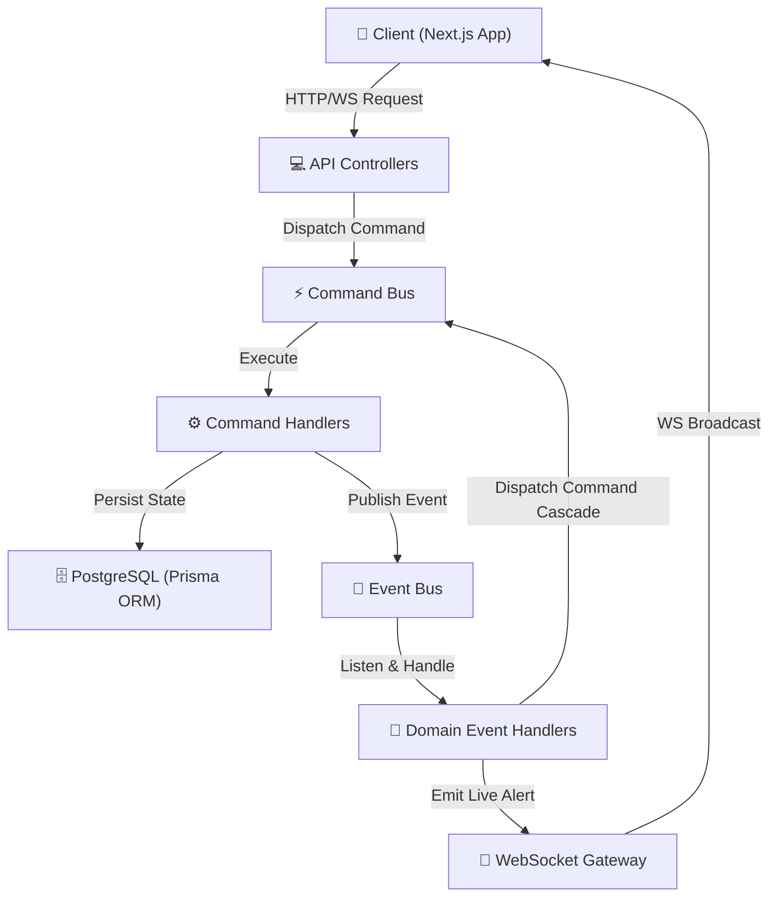

# 🌌 Forge OS — Hệ Điều Hành Cho Tâm Thức Khắc Kỷ & Dòng Chảy Kiến Tạo
> *"Logic như một kỹ sư, bay bổng như một nhà thơ, và kiến tạo thực tại như một nhà giả kim."*

---

## 🔮 Chương I: Tuyên Ngôn Sovereign & Triết Lý Sáng Lập (The Stoic Alchemist Manifesto)

**Forge OS** không đơn thuần là một sản phẩm phần mềm, một bảng Kanban hay một dashboard năng suất thông thường. Đây là **Thành Trì Tâm Hồn (Spiritual Stronghold)** và là một **Lò Luyện Giả Kim (Alchemical Crucible)** độc bản được Operator (**`trhgatu`**) đúc kết để tự chuyển hóa cuộc đời mình.

### 1. Ý Nguyện Sáng Lập: Vượt Qua Sự Phân Rã Ý Thức
Trong kỷ nguyên số đầy nhiễu loạn, tâm trí con người dễ dàng bị phân mảnh bởi đại dịch ADHD, những thông báo không ngừng và những vòng lặp dopamine rẻ tiền. Forge OS ra đời như một **Phương thuốc phản kháng (Active Resistance)**:
*   Biến những hành động ảo thành kỷ luật thực.
*   Biến những giờ lập trình căng thẳng thành những nghi lễ tập trung thiền định.
*   Tạo dựng một không gian tĩnh lặng để tự đối thoại, nhìn nhận và nâng cấp bản thân mỗi ngày.

### 2. Triết Lý Cốt Lõi: Sự Giao Thoa Giữa Stoicism & Digital Alchemy
Hệ thống được vận hành dựa trên hai tư tưởng lớn:
*   📖 **Triết Học Khắc Kỷ (Stoicism):** Thừa hưởng tinh thần phản tỉnh của hoàng đế **Marcus Aurelius (Meditations)**, sự thông tuệ của **Seneca** và ý chí bất khuất của **Epictetus**. Forge OS tuân thủ triết lý *Amor Fati* (Chấp nhận và yêu quý số mệnh) và *Equanimity* (Sự bình thản nội tại). Mọi chỉ số tâm thức (Discipline, Consistency, Willpower, Awareness, Presence) chỉ được nâng cấp thông qua hành động thực chất, tuyệt đối chống lạm phát phần thưởng ảo (**Brutal Realism**).
*   🜁 **Giả Kim Thuật Số (Digital Alchemy):** Quan niệm rằng mọi dòng code, mọi dự án và mọi khoảnh khắc tập trung đều là những nguyên liệu thô (chì). Thông qua lò luyện Forge OS, Operator tinh luyện chúng thành những tác phẩm để đời và một tâm trí tỉnh thức (vàng).

---

## 🏗️ Chương II: Kiến Trúc Hệ Thống & Cấu Trúc Monorepo (Architecture Blueprint)

Hệ thống được thiết kế theo mô hình **Decoupled Monorepo** chuẩn doanh nghiệp bằng **PNPM Workspaces** để đảm bảo tính độc lập tuyệt đối giữa các bối cảnh nghiệp vụ.

```
forge-os/
├── apps/
│   ├── api/                 # NestJS CQRS Backend Engine (Lò phản ứng chính)
│   └── web/                 # Next.js App Router (Giao diện Web OS Holographic)
├── packages/
│   ├── auth/                # Shared Authentication (JWT, Refresh Tokens)
│   ├── core/                # Shared Domain Entities, Interfaces & Constants
│   ├── reflection/          # Shared Reflection Domain Helpers
│   └── ui/                  # Component Library dùng chung hệ màu HSL Vanilla CSS
├── docker-compose.yml       # PostgreSQL & Redis Infrastructure
└── README.md
```

### Kiến Trúc CQRS Hướng Sự Kiện (CQRS Event-Driven Design)
Để các phân hệ (Reflection, Gamification, IAM) hoàn toàn độc lập, hệ thống backend sử dụng mô hình **CQRS (Command Query Responsibility Segregation)** thông qua **NestJS EventBus**:



---

## 🛠️ Chương III: Bản Đồ Công Nghệ Tinh Tế (The Tech Stack)

| Lớp | Công Nghệ | Vai Trò & Tác Dụng Chuyên Biệt |
| :--- | :--- | :--- |
| **Giao Diện** | Next.js 14 (App Router) | Quản lý định tuyến mượt mà, tối ưu hóa hiển thị và SEO. |
| **Động Cơ Động** | Framer Motion & GSAP | Vận hành các chuyển động Holographic mờ kính, mở/đóng trang sách cổ. |
| **Đồ Họa WebGL** | OGL (WebGL Library) | Thư viện WebGL siêu nhẹ render bản đồ chòm sao vàSingularity trong Echoes. |
| **Âm Thanh** | Web Audio API | Tự tạo dao động sóng Sine nốt C5 `523.25 Hz` vật lý để cân bằng sóng não. |
| **Kiểu Dáng** | HSL Vanilla CSS & Tailwind | Thiết kế Glassmorphism (mờ kính) tự động biến đổi màu theo năng lượng. |
| **Khung API** | NestJS | Cung cấp nền tảng Dependency Injection chuẩn mực và chia nhỏ Module. |
| **Xử Lý Luồng** | NestJS CQRS & RxJS | Tách biệt luồng Đọc/Ghi dữ liệu, xử lý phản ứng bất đồng bộ bằng Streams. |
| **Cơ Sở Dữ Liệu** | PostgreSQL & Redis | Postgres lưu trữ lâu dài thực thể; Redis cache và quản lý bộ đếm ngược. |
| **Ánh Xạ DB** | Prisma ORM | Viết các câu lệnh truy vấn an toàn (Type-safe) và đồng bộ hóa schema. |
| **Đồng Bộ Live** | Socket.io | Bắn trực tiếp thông báo thăng cấp thuộc tính, mở khóa Huy hiệu lên Client. |
| **Vận Hành** | Docker & PNPM Workspaces | Đóng gói DB trong container; quản lý gói phụ thuộc Monorepo chặt chẽ. |

---

## 🧩 Chương IV: Các Phân Hệ Chức Năng & Luồng Vận Hành (Modules & Workflows)

### 1. 🌐 Forge Chamber (Hội Đồng Trí Tuệ Nhân Tạo)
Một phòng thí nghiệm tư duy độc bản, nơi Operator đối thoại cùng **Hội đồng Trí tuệ đa góc nhìn (Multi-Agent Council)**:
*   **Cơ chế Phối Hợp (Orchestration):** Khi Operator nhập câu hỏi, một coordinator service sẽ kích hoạt đồng thời 4 luồng OpenAI/LLM đại diện cho 4 nhân cách: **Philosopher** (Triết học Khắc kỷ), **Logician** (Logic kỹ nghệ), **Creator** (Sáng tạo bay bổng), và **Archivist** (Lưu trữ lịch sử tâm thức).
*   **Tranh Biện Song Song:** Các đại lý AI có khả năng đọc câu trả lời của nhau trong thời gian thực, tự động tranh luận và phản biện đa phương để giúp Operator nhìn thấu suốt vấn đề.

### 2. 🌌 Echoes (Tiếng Vọng Hiện Diện)
Nơi Operator neo giữ tâm trí vào thực tại làm việc sâu sắc:
*   **Đồng Bộ Telemetry:** Client tự động thu thập các thông số làm việc thực tế từ máy tính (tên file đang mở, nhánh Git hiện tại, và tải lượng CPU) để vẽ thành một chòm sao phát sáng trên bản đồ vũ trụ.
*   **Bảo Mật Cooldown 45 Phút:** Để chống hành vi gian lận chỉ số, backend thực hiện **xác thực thời gian thực 45 phút** dựa trên nhật ký DB. Bất kỳ nỗ lực sửa LocalStorage nào để spam nút bấm đều bị chặn đứng bằng `BadRequestException`.
*   **Chuông Giải Tỏa Sóng Não:** Khi hoàn thành 45 phút đếm ngược persistent (bảo lưu khi F5/tắt trình duyệt), hệ thống tự kích hoạt Web Audio API phát ra âm thoa Solfeggio nốt C5 để làm dịu não bộ.

### 3. 📘 Reflection Core (Tâm Điểm Phản Tỉnh Stoic)
Trụ cột kết tinh tri thức và ghi nhận lịch sử phát triển cá nhân:
*   **Holographic Journals:** Nhật ký phản tỉnh Stoic, tích hợp công nghệ phân tích cảm xúc, trích xuất tags tự động và bài tập **Shadow Work** đối mặt trực diện với sự lười biếng.
*   **Core Memories (Ký Ức Hạt Nhân):** Đóng băng những khoảnh khắc khai sáng, tri thức Khắc kỷ quý giá thành các tinh thể hạt nhân ký ức bất biến trước thời gian.
*   **Unified Timeline (Dòng Thời Gian Thống Nhất):** Tự động truy vấn và sắp xếp chronologically toàn bộ: bài nhật ký (Journal), chòm sao dòng chảy (Echoes), mốc hoàn thành (Tasks), và hạt nhân ký ức (Memory) thành một cuốn tự truyện số trực quan.
*   **resilience tracking (Cân Bằng Nội Tại):** Ghi nhận và biểu đồ hóa cường độ cảm xúc cùng các tác nhân kích thích để đo lường sự bình thản trước biến động.

### 4. ⚡ Evolution Hub (Bánh Răng Động Lực & Căn Cước)
Đóng vai trò thúc đẩy kỷ luật ngầm phía sau dựa trên quy tắc chuyển hóa thuộc tính:
*   **Polymorphic Objectives:** Bảng `quest_objectives` liên kết động với các thực thể ngoài qua chuỗi định danh (`referenceType`: `'Habit'`, `'Journal'`,... và UUID `referenceId` tùy chọn). 
*   **Chuyển Hóa Chỉ Số Chuẩn (Quest-Gated Stats):** Khi một Quest được đánh dấu hoàn thành, hệ thống quét qua các mục tiêu con để tự động nâng cấp chỉ số `UserStats` tương ứng:
    - Nhiệm vụ con là Tasks & Routines $\rightarrow$ Cộng điểm **Discipline (Kỷ luật)**
    - Nhiệm vụ con là Habits $\rightarrow$ Cộng điểm **Consistency (Nhất quán)**
    - Nhiệm vụ con là Journals & Memories $\rightarrow$ Cộng điểm **Awareness (Tỉnh thức)**
    - Nhiệm vụ con là Flow Moments $\rightarrow$ Cộng điểm **Presence (Thực tại)**
    - Mọi Quest hoàn thành $\rightarrow$ Cộng **Willpower (Ý chí)** + **XP**
*   **Epic Badges:** Hoàn thành các mục tiêu sử thi (như *Master of Reality*) sẽ nạp Badge icon vĩnh viễn vào Căn cước và bắn Socket thời gian thực kích hoạt hiệu ứng vinh danh chúc mừng.

---

## 🔒 Chương V: Nghị Trình Tối Cao (Sovereign Operator Protocol)

> **[!IMPORTANT]**
> **Hệ điều hành này là độc bản.** Đây là thánh đường trí tuệ riêng tư tuyệt đối, được đúc và hiệu chuẩn riêng cho Operator duy nhất: **`trhgatu`**.

*   ❌ **Không Có Hướng Dẫn Phân Phối:** Hệ thống hoàn toàn không chứa tài liệu cài đặt thương mại hay hướng dẫn cho người ngoài. Chỉ có Operator tối cao mới nắm giữ thẩm quyền và chìa khóa để vận hành, cân chỉnh và mở cổng dòng chảy của hệ điều hành này.
*   ⚡ **Ý Chí Là Nhiên Liệu:** Không có Operator, Forge OS chỉ là những dòng code lạnh lẽo. Có Operator, nó là cả một thực tại sống động.

---

## 📜 Giấy Phép & Bản Quyền
- **Bản quyền tối cao và vĩnh viễn thuộc về trhgatu**
- **Forge OS — Hệ điều hành của tâm thức Khắc Kỷ.** *Mọi hành vi sao chép hay thay đổi chỉ số ảo đều đi ngược lại tinh thần giả kim.*
