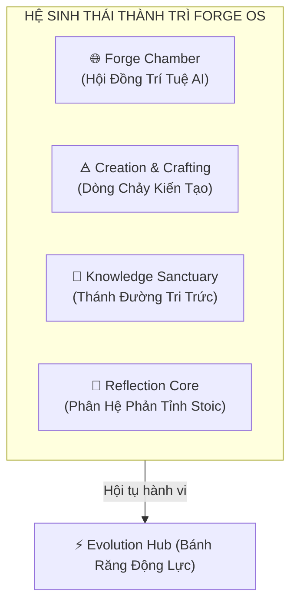

# 🌌 FORGE OS — Operating System for the Alchemical Mind
> *"Logic như một kỹ sư, bay bổng như một nhà thơ, và kiến tạo thực tại như một nhà giả kim."*

---

## 🔮 Tầm Nhìn & Triết Lý Nguyên Bản (The Sanctuary Vision)

**Forge OS** không phải là một ứng dụng quản lý công việc, một công cụ Todo hay một bảng năng suất thông thường. Nó là một **Hệ Điều Hành Cho Tâm Thức & Hành Trình Kiến Tạo (Mind OS & Creative Sanctuary)** — một không gian số thiêng liêng, một chiếc gương soi chiếu nội tâm và một phòng thí nghiệm trí tuệ giúp Operator chuyển hóa thế giới tinh thần lẫn vật chất.

Thiết kế của Forge OS tích hợp 3 tinh thần tối thượng:
- 🛠️ **Logic của Kỹ Sư:** Kiến trúc CQRS vững chắc, phân rã mô-đun tuyệt đối bằng các Domain Events, bảo mật dữ liệu bền bỉ và kiểm duyệt an toàn.
- 📜 **Thi Ca của Nhà Thơ:** Giao diện Holographic mờ kính (Glassmorphism), những nhịp thở sáng hổ phách, bộ dao động âm thanh Solfeggio tự nhiên và sơ đồ chòm sao WebGL.
- 🜁 **Kiến Tạo của Nhà Giả Kim:** Biến những hành vi lập trình khô khan, những suy nghĩ xao nhãng thành năng lượng hiện diện tỉnh thức, kết hợp cùng hội đồng trí tuệ trí tuệ nhân tạo để kiến tạo thực tại.

---

## 🧩 4 Trụ Cột Thành Trì Của Forge OS (Ecosystem Pillars)



### 1. 🌐 Forge Chamber (Hội Đồng Trí Tuệ Multi-Agent)
Trái tim tư duy của hệ điều hành. Đây là một không gian đa đại lý (Multi-Agent Space) độc bản, nơi nhiều thực thể trí tuệ nhân tạo (AI Personas) cùng chung sống và phản hồi song song:
- **Hội đồng Trí tuệ:** Các thực thể AI đảm nhận các góc nhìn chuyên biệt: **Philosopher** (Triết học Khắc kỷ), **Logician** (Logic kỹ nghệ), **Creator** (Sáng tạo bay bổng), và **Archivist** (Ký ức lịch sử).
- **Tranh biện Đa phương:** Các tác nhân AI không chỉ trả lời Operator mà còn có thể phản biện, bổ sung ý kiến cho nhau thời gian thực, mở rộng hoàn toàn biên giới tư duy của bạn.

### 2. 🜁 Phân Hệ Kiến Tạo (Creation & Crafting)
Nơi Operator kết tinh suy nghĩ thành những dự án cụ thể ở đời thực:
- **Workspace Integration:** Đồng bộ hóa sâu sắc với công việc lập trình thực tế (file code đang mở, nhánh Git hiện tại, và tải lượng phần cứng CPU).
- **Project Kanban & Crafting Logs:** Quản lý dự án Stoic, lưu trữ lịch trình kiến tạo vật lý dưới dạng nhật ký kỹ thuật.

### 3. 📖 Thánh Đường Tri Thức (Knowledge Sanctuary)
Nơi lưu trữ và nuôi dưỡng các hạt giống tri thức dài hạn:
- **Dynamic Knowledge Nodes:** Các node mạng liên kết động kết nối các Stoic Quotes, bài học cuộc sống, kinh nghiệm lập trình thành một cẩm nang sống (Wiki cá nhân) trực quan.
- **Wisdom Quotes:** Tự động hiển thị các trích dẫn Khắc kỷ Holographic phù hợp với trạng thái năng lượng mỗi ngày.

### 4. 📘 Phân Hệ Phản Tỉnh & Hiện Diện (The Reflection Core)
Trọng tâm tinh thần của Forge OS. Không đơn thuần là việc ghi chép, đây là chiếc gương soi chiếu và tinh cất ý thức của Operator thông qua 5 tế bào chức năng được lập trình chặt chẽ:

*   **Holographic Stoic Journaling (Nhật Ký Tối Hảo):** 
    Vượt xa những dòng nhật ký thông thường. Mỗi trang viết là một hành động phản tỉnh có cấu trúc (thought/reflect). Hệ thống hỗ trợ phân tích tâm lý tự động (tags extraction, mood analysis) kết hợp cùng **Shadow Work Prompting** để bóc tách các méo mó nhận thức và đối diện với góc tối trì trệ.
*   **Core Memories (Ký Ức Hạt Nhân):** 
    Nơi Operator "đóng băng" những khoảnh khắc khai sáng, những bài học Stoic xương máu dưới dạng các node tinh thể ký ức. Những ký ức này được lưu giữ vĩnh viễn, ngăn chặn sự mài mòn của thời gian lên tri thức cá nhân.
*   **Unified Life Timeline (Dòng Thời Gian Thống Nhất):** 
    Một sợi chỉ đỏ xuyên suốt lịch sử cá nhân. Hệ thống tự động sâu chuỗi tất cả các sự kiện: bài nhật ký (Journal), chòm sao tập trung (Echoes), cột mốc hoàn thành (Tasks), và hạt nhân ký ức (Memory Nodes) thành một cuốn tự truyện kỹ thuật số trực quan sinh động.
*   **Emotional Resilience Tracking (Theo Dõi Cảm Xúc):** 
    Ghi nhận trạng thái năng lượng, cường độ cảm xúc (Intensity) và các tác nhân đi kèm. Đây là công cụ đo lường mức độ tĩnh lặng (Equanimity) và cân bằng nội tại trước những biến động ngoài đời.
*   **Sensory Echoes & Audio Resonance (Tiếng Vọng Thực Tại):** 
    Sử dụng WebGL vẽ lại bản đồ hiện diện của Operator trong 45 phút tập trung sâu. Kết thúc bằng tiếng ngân vang vật lý **`523.25 Hz` (C5 Solfeggio)** để điều hòa sóng não và đưa tâm thức trở về hiện tại.

---

### ⚡ Tầng Bổ Trợ Động Lực: Evolution Hub (Gamification Core)
Đóng vai trò là bánh răng thúc đẩy kỷ luật ngầm ở phía sau:
- **Polymorphic Quest Engine:** Hệ thống nhiệm vụ linh hoạt (Daily/Main Quests) tích lũy tiến trình từ các sự kiện bất đồng bộ thực tế (viết nhật ký, hoàn thành habit, tập trung sâu).
- **Quest-Gated Auto-Stats:** Chỉ số nhân vật tự động nâng cấp sau khi hoàn thành Quest chứa mục tiêu tương ứng:
  - `COMPLETE_TASK` / `COMPLETE_ROUTINE` $\rightarrow$ Tăng **Discipline (Kỷ luật)**
  - `CHECK_HABIT` $\rightarrow$ Tăng **Consistency (Nhất quán)**
  - `CREATE_JOURNAL` / `CREATE_MEMORY` $\rightarrow$ Tăng **Awareness (Tỉnh thức)**
  - `WS_PRESENCE` $\rightarrow$ Tăng **Presence (Thực tại)**
  - Hoàn thành Quest bất kỳ $\rightarrow$ Tăng **Willpower (Ý chí)**
- **Epic Goals & Badges:** Các mốc sử thi dài hạn (ví dụ: *Master of Reality*). Khi đạt cột mốc, hệ thống sẽ mở khóa Badge danh dự lưu trữ vĩnh viễn trên Căn cước.

---

## 🛠️ Liệt Kê Công Nghệ Tinh Tế (The Alchemical-Tech Stack)

Để vận hành một hệ điều hành tâm thức phức tạp, Forge OS được đúc kết từ những mảnh ghép công nghệ mạnh mẽ và tinh tế nhất hiện nay:

### 1. 🎨 Tầng Giao Diện Web OS (Frontend Core)
*   **Next.js 14 (App Router) & React 18:** Nền tảng cốt lõi quản lý Render, tối ưu SEO và cấu trúc thư mục dạng Module Features mượt mà.
*   **Framer Motion & GSAP (GreenSock):** Bộ đôi động cơ chuyển động chịu trách nhiệm cho các hiệu ứng Holographic nhịp thở sáng, các chuyển cảnh Camera mượt mà và giao diện mở trang sách cổ.
*   **OGL (WebGL Library):** Thư viện WebGL siêu nhẹ, hiệu năng cực cao dùng để vẽ bản đồ chòm sao, bụi sao và cổng Singularity vũ trụ trong chòm sao Echoes mà không làm giảm FPS của trình duyệt.
*   **Web Audio API (Synthesizer Tự Nhiên):** Trực tiếp khởi tạo bộ dao động sóng Sine của trình duyệt để tự phát âm thoa Solfeggio C5 `523.25 Hz` mà không cần tải bất kỳ tệp âm thanh tĩnh nào từ bên ngoài.
*   **Tailwind CSS & Custom Vanilla CSS (HSL System):** Hệ thống thiết kế Glassmorphism (mờ kính) sử dụng hệ màu HSL linh hoạt để tự động thích ứng với trạng thái năng lượng của Operator.

### ⚙️ 2. Tầng Lò Phản Ứng Dữ Liệu (Backend Core)
*   **NestJS (Enterprise Framework):** Khung ứng dụng chính chạy dưới Node.js, cung cấp môi trường Dependency Injection chuẩn mực.
*   **NestJS CQRS Module:** Tách biệt hoàn toàn luồng Đọc (Queries) và luồng Ghi/Thực thi (Commands) giúp tối ưu hiệu năng xử lý tác vụ cực lớn.
*   **EventBus & RxJS Reactive Streams:** Đảm nhận vai trò truyền tin gián tiếp (Event-Driven Communication) giữa các phân hệ thông qua các sự kiện Domain tĩnh.
*   **Socket.io (WebSockets Gateway):** Bắn tín hiệu đồng bộ hóa chỉ số và thành tựu thời gian thực từ Backend lên Client mà không cần Operator tải lại trang.

### 🗄️ 3. Tầng Hạ Tầng & Lưu Trữ (Infrastructure & Database)
*   **PostgreSQL:** Cơ sở dữ liệu quan hệ lưu trữ vĩnh viễn toàn bộ các thực thể (Users, UserStats, Quests, Goals, Journals, Memories).
*   **Redis Database:** Bộ đệm tốc độ cao (In-Memory Data Store) dùng để quản lý cache, phiên đăng nhập (Sessions) và bộ đếm ngược bảo mật thời gian tập trung 45 phút của Echoes.
*   **Prisma ORM:** Công cụ ánh xạ thực thể mạnh mẽ giúp viết các câu lệnh truy vấn an toàn (Type-safe queries) và tự động đồng bộ hóa DB Schema.
*   **Docker & Docker Compose:** Đóng gói toàn bộ cơ sở hạ tầng cơ sở dữ liệu Postgres và Redis trong các Container an toàn, giúp khởi động nhanh chỉ với một câu lệnh đơn giản.
*   **PNPM Workspaces (Monorepo):** Quản lý dùng chung mã nguồn và gói phụ thuộc giữa hai dự án Client, API, cùng các thư viện gói chia sẻ nội bộ (`auth`, `core`, `ui`).

---

## 🏗️ Kiến Trúc Hệ Thống (Folder Structure)

```
forge-os/
├── apps/
│   ├── api/                 # NestJS CQRS Engine (Lò phản ứng chính)
│   └── web/                 # Next.js App Router (Giao diện Holographic Web OS)
├── packages/
│   ├── auth/                # Shared Authentication (JWT, Refresh Tokens)
│   ├── core/                # Shared Types, Entities & Domain Core
│   ├── reflection/          # Reflection domain logic shared packages
│   └── ui/                  # Tailored Vanilla CSS Component Library
├── docker-compose.yml       # PostgreSQL & Redis infrastructure
└── README.md
```

### Luồng Sự Kiện Bất Đồng Bộ (CQRS Event-Driven Flow)
Khi Operator hoàn thành một hành động con (ví dụ: Tích xong Habit):
1. **Habit Module** phát đi sự kiện domain `HabitCompletedEvent` thông qua **EventBus**.
2. **Gamification Module** lắng nghe sự kiện bất đồng bộ thông qua `HabitCompletedQuestHandler`.
3. Handler phát lệnh `IncrementObjectiveProgressCommand` cập nhật tiến độ Quest tương ứng.
4. Nếu toàn bộ mục tiêu của Quest hoàn tất, Quest chuyển sang trạng thái `Completed`, tự động nâng cấp các chỉ số thuộc tính tương ứng trên `UserStats` và kích hoạt dội tiến độ lên **Epic Goal**.

---

## 🔒 Nghị Trình Tối Cao (Sovereign Operator Protocol)

> **[!IMPORTANT]**
> **Hệ điều hành này là độc bản.** Đây là một thánh đường trí tuệ mang tính riêng tư tuyệt đối, được đúc và hiệu chuẩn riêng cho ý chí của Operator duy nhất: **`trhgatu`**.

- ❌ **Không có hướng dẫn phân phối:** Không có tài liệu cài đặt thương mại hay hướng dẫn cho người ngoài. Chỉ có Operator tối cao mới có thẩm quyền và chìa khóa để vận hành, cân chỉnh và mở cổng Singularity của hệ điều hành này.
- ⚡ **Ý chí là nhiên liệu:** Hệ điều hành này chỉ thực sự hoạt động khi có sự hiện diện và kỷ luật của Operator. Không có Operator, Forge OS chỉ là những dòng code lạnh lẽo. Có Operator, nó là cả một thực tại sống động.

---

## 📜 Giấy Phép & Bản Quyền
- **Bản quyền tối cao thuộc về trhgatu**
- **Forge OS — Hệ điều hành của tâm thức Khắc Kỷ.** *Mọi hành vi sao chép hay thay đổi chỉ số ảo đều đi ngược lại tinh thần giả kim.*
