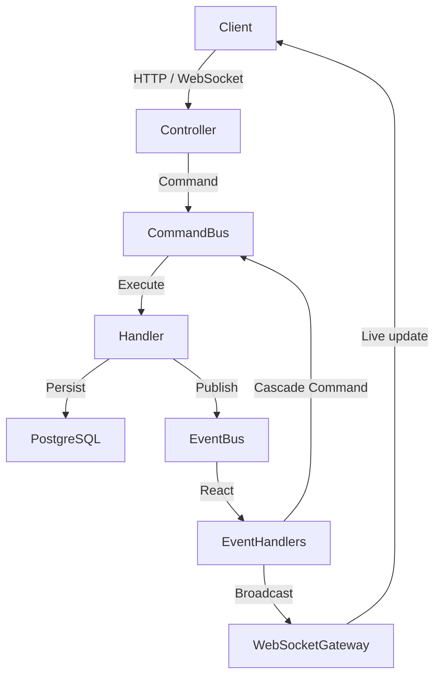

# Forge OS

> *Logic như một kỹ sư. Bay bổng như một nhà thơ. Kiến tạo thực tại như một nhà giả kim.*

Forge OS là hệ điều hành cá nhân được xây dựng từ đầu bởi **trhgatu** — không phải một app năng suất, không phải một dashboard thông thường. Đây là nơi kỷ luật được rèn giũa, tâm thức được quan sát, và từng dòng code trở thành một nghi lễ.

---

## Triết lý

Hệ thống vận hành trên hai trục tư tưởng:

**Stoicism** — Tinh thần phản tỉnh của Marcus Aurelius, sự thực hành *amor fati* và bình thản nội tại. Mọi chỉ số trong hệ thống (Discipline, Consistency, Willpower, Awareness, Presence) chỉ tăng qua hành động thực chất. Không có điểm thưởng ảo.

**Digital Alchemy** — Mỗi dòng code, mỗi dự án, mỗi khoảnh khắc tập trung là nguyên liệu thô. Forge OS là lò luyện biến chúng thành thứ có giá trị lâu dài.

---

## Kiến trúc

Monorepo với PNPM Workspaces, tách biệt hoàn toàn giữa các bounded context.

```
forge-os/
├── apps/
│   ├── api/        # NestJS — CQRS backend engine
│   └── web/        # Next.js App Router — giao diện chính
├── packages/
│   ├── auth/       # JWT, refresh token, shared auth types
│   ├── core/       # Shared domain entities & interfaces
│   ├── reflection/ # Shared reflection domain helpers
│   └── ui/         # Component library, HSL design tokens
└── docker-compose.yml
```

### CQRS Event-Driven

Backend tách biệt luồng đọc/ghi qua NestJS CommandBus và EventBus. Khi một command hoàn thành, domain event được publish — các context khác (Gamification, Audit Log, WebSocket) lắng nghe và phản ứng độc lập, không phụ thuộc lẫn nhau.



---

## Tech Stack

| Layer | Tech | Vai trò |
|---|---|---|
| Frontend | Next.js 14 App Router | Routing, rendering, SSR |
| Animation | Framer Motion, GSAP | Chuyển động UI |
| WebGL | OGL | Render đồ họa chòm sao trong Echoes |
| Audio | Web Audio API | Âm thanh sine wave 523.25 Hz khi kết thúc session |
| Styling | Tailwind + HSL Vanilla CSS | Glassmorphism, dynamic color theo trạng thái |
| Backend | NestJS | DI container, module system |
| Async | CQRS + RxJS | Tách luồng read/write, reactive streams |
| Database | PostgreSQL + Prisma | Lưu trữ lâu dài, type-safe queries |
| Cache | Redis | Cache layer, cooldown counters |
| Realtime | Socket.io | Live notifications, XP events |
| Infra | Docker + PNPM Workspaces | Container hóa DB, quản lý monorepo |

---

## Các module chính

### Forge Chamber
Không gian tư duy với multi-agent AI. Bốn góc nhìn được kích hoạt song song khi đặt câu hỏi — Philosopher, Logician, Creator, Archivist — có thể đọc và phản biện lẫn nhau trong thời gian thực.

### Echoes
Ghi nhận trạng thái làm việc sâu (deep work). Client thu thập telemetry thực tế từ máy (tên file, nhánh Git, CPU load) và vẽ thành bản đồ chòm sao. Mỗi session được backend xác thực cooldown 45 phút — không thể gian lận bằng cách sửa localStorage. Khi hết đếm ngược, hệ thống phát âm thanh sine C5 để đánh dấu kết thúc session.

### Reflection Core
Bao gồm Journal (nhật ký Stoic), Memory (lưu trữ những khoảnh khắc quan trọng), Mood tracking, và Timeline — tự động tổng hợp toàn bộ lịch sử thành một dòng thời gian liên tục theo thứ tự thời gian thực.

### Evolution Hub
Hệ thống gamification có cấu trúc. Quest chứa các objective liên kết động với các entity khác (Habit, Journal, Task...) qua `referenceType` và `referenceId`. Khi Quest hoàn thành, hệ thống tự động cộng điểm vào chỉ số tương ứng:

- Tasks, Routines → Discipline
- Habits → Consistency
- Journals, Memories → Awareness
- Flow Moments (Echoes) → Presence
- Mọi Quest → Willpower + XP

### IAM
Phân quyền đầy đủ với Users, Roles, Permissions, Audit Log. JWT access token + refresh token rotation.

---

## Giấy phép

Forge OS là dự án cá nhân, không phát hành thương mại.  
© trhgatu — All rights reserved.